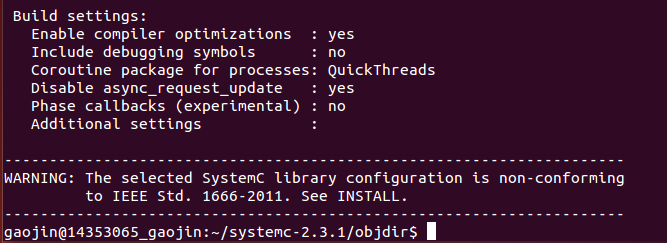
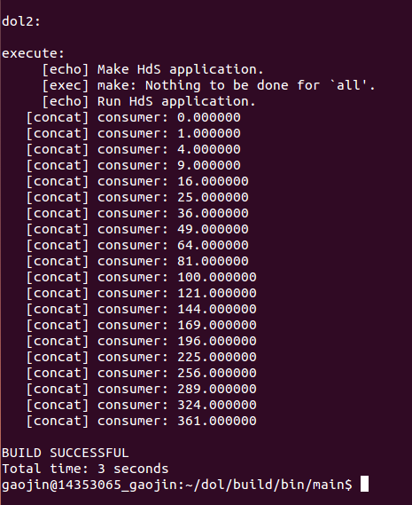

#DOL开发环境配置

### Description

   Distributed Operation Layer : 
The distributed operation layer (DOL) is a software development framework to program parallel applications. The DOL allows to specify applications based on the Kahn process network model of computation and features a simulation engine based on SystemC. Moreover, the DOL provides an XML-based specification format to describe the implementation of a parallel application on a multi-processor systems, including binding and mapping.
 
### How to install
  1 . 安装必要环境

         >$	sudo apt-get update
  
         >$	sudo apt-get install ant
 
         >$ sudo apt-get install openjdk-7-jdk
 
         >$	sudo apt-get install unzip
 

  2 . 下载必要文件
         
        >sudo wget http://www.accellera.org/images/downloads/standards/systemc/systemc-2.3.1.tgz
        
        >sudo wget http://www.tik.ee.ethz.ch/~shapes/downloads/dol_ethz.zip

 
  3 . 解压文件

   * 新建dol的文件夹   
     
               > $	mkdir dol
   * 将dolethz.zip解压到 dol文件夹中
     
               > $	unzip dol_ethz.zip -d dol
   * 解压systemc
     
               > $	tar -zxvf systemc-2.3.1.tgz

  4 . 编译systemc

   * 解压后进入systemc-2.3.1的目录下
     
            >$	cd systemc-2.3.1
   * 新建一个临时文件夹objdir
     
            >$	mkdir objdir
   * 进入该文件夹objdir
     
            >$	cd objdir
   * 运行configure(能根据系统的环境设置一下参数，用于编译)，进行编译，记录路径
     
            >$	../configure CXX=g++ --disable-async-updates
        
   运行结果如图一所示：

图一

 
    
            > $	sudo make install
            > $ cd ..        $ ls
            > $	pwd

          
   编译结束之后目录如图二所示：    

  
图二
           
   路径结果如图三所示:

  图三

5 . 编译dol

   * 进入刚刚dol的文件夹，修改build_zip.xml文件，找到下面这段话，就是说上面编译的systemc位置在哪里， 
  
  		        *property name="systemc.inc" value="YYY/include"/*

                *property name="systemc.lib" value="YYY/lib-linux/libsystemc.a"/*

      
     把YYY改成上页pwd的结果（注意，对于  64位 系统的机器，lib-linux要改成lib-linux64）
   * 编译
    

            >  $	ant -f build_zip.xml all
         
     若成功会显示build successful

   * 成功之后尝试运行第一个例子
   
       * 进入build/bin/mian路径下 
         
                  > $	cd build/bin/main
       * 然后运行第一个例子
         
                  > $	ant -f runexample.xml -Dnumber=1v
            
      成功结果如图四所示

   
             
  图四
### Experimental experience

   这次实验因为是第一次做关于DOL的配置，刚开始做的时候有点蒙，但是跟着老师给出的PPT走还是可以做好的，这次实验出现了一些问题我总结一下是：
  
 * 这次实验经常发生VM连不上网的状态，然后通过百度进行了很多方法来进行解决，首先我在电脑-服务中启用关于VM的所有功能，然后也可以在VM的网络编辑器中进行初始化来使VM联网。一旦连不上网，就无法进行更新操作了下载操作。
 * 在进行编译dol的时候要根据之前编译systemc的目录的lib-linux中看到并且确定自己的VM是几位的，保证在后面更改build_zip.xml的时候更改正确，因为不知道自己是几位的机，导致改错了，这个问题导致我很久都不能继续进行。
 * 在这次首次使用MarkdownPad这个软件，还有点不太熟悉，但是内容很好，很实用，但是对空格和换行还不太熟悉，以后经常使用会更加熟悉。关于数字的有序排列我觉得还有很多问题需要解决和探索。

   

 

