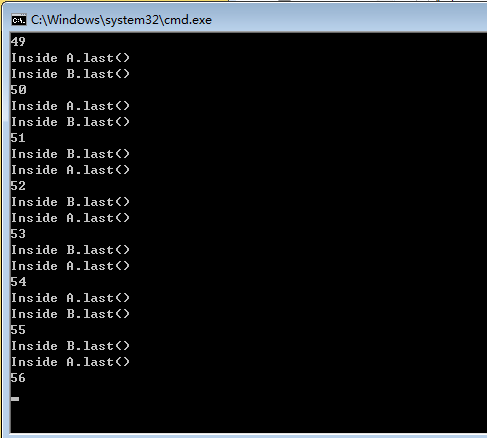

#死锁
* 实验截图

如图所示当运行到56次的时候产生死锁。

* 死锁产生的四个必要条件

死锁就是两个或者多个进程，互相请求对方占有的资源。

 	1. 互斥条件：一个资源每次只能被一个进程使用
 	2. 请求与保持条件：一个进程因请求资源而阻塞时，对已获得的资源保持不放
 	3. 不剥夺条件:进程已获得的资源，在末使用完之前，不能强行剥夺
 	4. 循环等待条件:若干进程之间形成一种头尾相接的循环等待资源关系

* 对该程序产生死锁的解释

	当构造函数中a.methodA调用后。进入B类，执行methodB方法，执行完打印语句后，并没执行a.last()，也就是说，现在主线程还没有结束，依然锁定B中的methodB方法。但是，这时，另外一个线程run了，调用A类中的method方法，当执行b.last()时，需要等待B中say方法的执行完成，才能执行B的last方法，而B的say要继续执行，需要等待A的say方法执行完成。所以，互锁了。